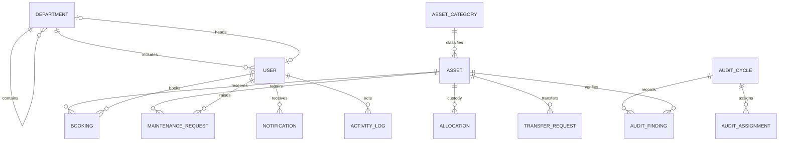

# AssetFlow ERD v0

The canonical fields are defined in `docs/PROJECT_SPEC.md`; migrations are the executable schema source. Polymorphic allocation holders and transfer endpoints are represented using a holder type/identifier or JSON payload until the domain layer finalizes repository mappings.

