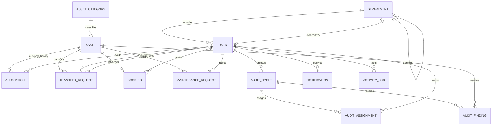

# AssetFlow ERD

The migrations are the executable schema source. This diagram records the canonical entities and the relationships enforced by migrations `001_extensions.sql` through `006_exit_clearance.sql`.

## Database invariants

- `asset_tag_seq` is owned by `assets.asset_tag` and generates values such as `AF-0001`.
- `users.email` uses `CITEXT` and the `users_email_key` uniqueness constraint.
- `asset_categories.custom_fields` is `JSONB` with `asset_categories_custom_fields_gin`.
- `allocations_one_active_per_asset_idx` permits only one active allocation per asset.
- `bookings_no_active_overlap_excl` uses half-open `tstzrange` values and participates only for `upcoming` and `ongoing` bookings.
- `activity_log_append_only` and `assetflow_app` permissions prevent mutation of existing ActivityLog rows.
- `users_exit_clearance_guard_trg` emits SQLSTATE `AF001` with diagnostic `users_exit_clearance_required` when active custody or upcoming bookings block deactivation.
- Analytics views (`v_ghost_risk`, `v_utilization`, `v_maintenance_frequency`, `v_department_allocation_summary`, `v_booking_heatmap`, and `v_dashboard_kpis`) are computed in PostgreSQL.

Allocation holders use the locked polymorphic `holder_type`/`holder_id` contract. Transfer endpoints store their holder payloads as JSONB; the service layer owns validation for those polymorphic values.
